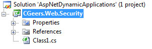
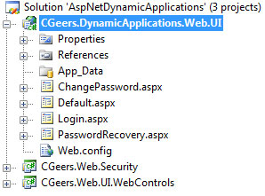

# ASP.NET: Supporting Dynamic Applications

## Introduction

The ASP.NET membership feature reduces the amount of code you have to write to authenticate users and store their credentials. To quote MSDN:

_"The [ASP.NET membership](http://msdn.microsoft.com/en-us/library/yh26yfzy.aspx) gives you a built-in way to validate and store user credentials. You use the ASP.NET membership with Forms authentication and / or with the ASP.NET login controls for authenticating users."_

The membership provider needs to be specified in the Web.config configuration file. You can use your own custom provider or one of the default providers that ships with the .NET Framework, such as the [SqlMembershipProvider](http://msdn.microsoft.com/en-us/library/system.web.security.sqlmembershipprovider.aspx) provider.

All of the user related data is stored in a set of tables used by the ASP.NET membership system. In most cases you'll use one set of tables per web application. However you can also reuse the same set to store the user credentials of multiple web applications. This effectively enables you to create one web application that acts as a portal allowing you to log in to one of these "virtual" applications.

However this isn't possible out of the box. You have some work ahead of you, before you can support such dynamic applications.

Let's get started...

## Application Context

Let's start by examining the following Web.config entry:

**Listing 1** - Web.Config ASP.NET Membership Configuration

```xml
<membership defaultProvider="SqlProvider">
  <providers>
    <clear />
    <add name="SqlProvider"
        type="System.Web.Security.SqlMembershipProvider"
        connectionStringName="YourConnectionStringName"
        applicationName="MyApplication"
      ... />
  </providers>
</membership>
```

These settings setup your web application to use the SqlMembershipProvider to manage your user credentials. All of the data related to your users is stored in the default ASP.NET membership tables.

**Remark**: This article is not a primer on ASP.NET membership, you should be familiar with it. Use the [ASP.NET SQL Server Registration Tool](http://msdn.microsoft.com/en-us/library/ms229862%28VS.80%29.aspx) (aspnet_regsql.exe) for setting up your database.

As mentioned before you can store the user credentials of multiple web applications in the same set of tables. Each web application separates their user data by partitioning them, in what I call, an application context. This application context is defined by the applicationName property of the membership provider. As you can see in Listing 1 the application name is "MyApplication".

The SqlMembershipProvider uses this setting to determine in which context it should operate, all of the user data tied to this application name will be accessible by the ASP.NET membership library and login controls.

Unfortunately this setting is statically defined in the Web.config. You cannot easily change it during runtime. If you want to support dynamic applications, you need a way to control the value of the provider's ApplicationName property. The solution lies in creating your very own ASP.NET Membership provider.

## Dynamic Applications SqlMembershipProvider

The SqlMembershipProvider retrieves the value for its ApplicationName property from the configuration settings contained in the Web.config file. We want to change the value which the getter of this property returns.

When logging in the user should make his intentions clear, in other words he has to specify which of the virtual applications he wants to access. For this purpose I require that the user not only specifies his username and password but also the virtual application he wants to access. From the user's point of view I call this virtual application, the domain.

For example, suppose you have established a Sql Server database called AspNetMembership which contains the ASP.NET membership tables. This database contains the following virtual applications defined in the aspnet_Applications table:

- Northwind
- AdventureWorks

Each virtual application contains a user with the username "cgeers". Now if I want to log in to the Northwind application I have to enter my username as "Northwind\\cgeers". For the AdventureWorks application this would be "AdventureWorks\\cgeers".

The part preceding the username is the application name or as far as the user is concerned this is the domain he has to enter in order to specify which virtual application he wants to access. The domain and the username are separated by a backslash.

When the user logs in using the ASP.NET Login control we have to extract the domain he entered and store this in a location which our custom membership provider can access. However we have to take into account that ASP.NET operates in a multithreaded environment. Each request received by ASP.NET is handled by a separate thread. We can't store the domain in just any location, otherwhise other incoming requests might overwrite it. It must be tied to a single request.

The ideal place to store contextual information that is tied to an individual request is the current Http context. This contextual information is encapsulated by the [HttpContext](http://msdn.microsoft.com/en-us/library/system.web.httpcontext.aspx) class.

Start up Visual Studio and create a new blank solution called "AspNetDynamicApplications". Next add a new Class Library project to the solution named "CGeers.Web.Security". Add references to the System.Configuration and System.Web assemblies. Our custom provider will descend from the default SqlMembershipProvider so these references are required.

**Figure 1** - Visual Studio Solution



Rename the automatically generated Class1.cs file to DynamicApplicationsSqlMembershipProvider.cs and add the code shown in Listing 2.

**Listing 2** - DynamicApplicationsSqlMembershipProvider

```csharp
public class DynamicApplicationsSqlMembershipProvider : SqlMembershipProvider
{
    #region Fields

    private const string ApplicationNameSetting = "ApplicationName";

    #endregion

    public override string ApplicationName
    {
        get
        {
            HttpContext context = HttpContext.Current;
            if (context == null)
            {
                throw new InvalidOperationException("Http context cannot be null.");
            }

            string applicationName = String.Empty;
            if (context.Items.Contains(ApplicationNameSetting))
            {
                if (!String.IsNullOrEmpty((string)context.Items[ApplicationNameSetting]))
                {
                    applicationName = (string)context.Items[ApplicationNameSetting];
                }
            }
            return applicationName;
        }
        set
        {
            base.ApplicationName = value;
        }
    }
}
```

As you can see our custom membership provider descends from the default SqlMembershipProvider and overrides the ApplicationName property. We aren't concerned with the setter, only with the getter. When the provider reads the ApplicationName property we get a handle to the current Http context by calling the static Current property of the HttpContext class. The obtained HttpContext object has a key/value collection property called Items. This collection stores the application name in an entry identified by the key "ApplicationName". The name of this key is something you have to determine at design time.

Now each time our custom membership provider needs to determine the application name it calls the ApplicationName property which retrieves the value from the current Http context. This works in ASP.NET's multithreaded environment as each request is tied to its own Http context.

## Login Control

Now that we a custom membership provider that retrieves the value for its ApplicationName property from the currect Http context, we still have to figure out a way to actually store the application name in the Http context.

The first time that a user specifies the virtual application or domain he wants to access is when he logs in. As mentioned earlier the user has to enter his username in the format `<domain>\<username>`. We have to create our own Login control which descends from the ASP.NET Login control. Upon user authentication we need to extract the entered domain and save it in the current Http context.

Add a new project using the Class Library template to your solution called "CGeers.Web.UI.WebControls". Add the following references to the project:

- System.Configuration
- System.Web
- CGeers.Web.Security

Next delete the automatically generated Class1.cs file and add a new class called DynamicApplicationsLogin. Since the code for this class is quite lengthy I've chosen to break it up into several listings. After each listing a brief explanation of the code is added.

**Listing 3** - DynamicApplicationsLogin Control Private Properties

```csharp
public class DynamicApplicationsLogin : Login
{
    #region Fields

    private string _fullUserName;

    #endregion

    #region Properties

    private string ApplicationName
    {
        get
        {
            string[] data = base.UserName.Split(@"\".ToCharArray(), 2);
            string applicationName = (data.Length == 2) ? data[0] : String.Empty;
            return applicationName;
        }
    }

    private string BaseUserName
    {
        get
        {
            string[] data = base.UserName.Split(@"\".ToCharArray(), 2);
            string userName = (data.Length == 2) ? data[1] : base.UserName;
            return userName;
        }
    }

    #endregion

   // ...
}
```

As you can see the DynamicApplicationsLogin control descends from the standard ASP.NET Login control and a field called \_fullUserName and two private properties ApplicationName and BaseUserName are added.

Since the user enters the domain and username into the same TextBox control we need to split up these parts. As you might guess the ApplicationName property extracts the domain and the BaseUserName returns the username. For example if the user enters Northwind\\cgeers, the ApplicationName property would return "Northwind" and the BaseUserName property would return "cgeers".

**Listing 4** - DynamicApplicationsLogin Control OnAuthenticate Method

```csharp
protected override void OnAuthenticate(AuthenticateEventArgs e)
{
    HttpContext context = HttpContext.Current;
    if (context == null)
    {
        throw new InvalidOperationException("Http context cannot be null.");
    }
    MembershipProvider provider = Membership.Provider;
    if (provider == null)
    {
        throw new InvalidOperationException("MembershipProvider cannot be null.");
    }
    provider = provider as DynamicApplicationsSqlMembershipProvider;
    if (provider == null)
    {
        throw new InvalidOperationException(
          "The specified MembershipProvider must be of type DynamicApplicationsSqlMembershipProvider.");
    }

    // Store the application name in the current Http context's items collections
    context.Items["ApplicationName"] = ApplicationName;

    // Validate the user
    _fullUserName = UserName;
    UserName = BaseUserName;
    base.OnAuthenticate(e);
}
```

Next you need to override the Login control's OnAuthenticate method to make sure that the user is validated inside the correct application context (virtual application).

First this method retrieves a reference to the current Http context, then it checks if the loaded membership provider is indeed our custom DynamicApplicationsSqlMembershipProvider. Then the entered domain or application name is stored in the current Http context's Items collection so that our membership provider can retrieve the correct value for its ApplicationName property.

Last but not least the UserName property's value is set to only contain the UserName by assigning the BaseUserName property to it. The private \_fullUserName field temporarily stores the value the user entered (domain\\username). You'll see how this field is used later on.

After the application name has been stored in the Http context and the UserName property only contains the username the base implementation is called, this causes the username to be validated inside of the correct application context.

**Listing 5** -DynamicApplicationsLogin Control OnLoginError Method

```csharp
protected override void OnLoginError(EventArgs e)
{
    UserName = _fullUserName;
    base.OnLoginError(e);
}
```

Override the OnLoginError method and before calling the base implementation assign the \_fullUserName field to the UserName property. When authenticating the user (OnAuthenticate method) the UserName property must only contain the username and not the domain, but when the authentication fails you need to make sure that the text the user entered in the TextBox control representing the UserName is reset to the value the user initially entered. Otherwhise it might be confusing for the user if the domain he entered disappears.

**Listing 6** - DynamicApplicationsLogin Control OnLoggedIn Method

```csharp
protected override void OnLoggedIn(EventArgs e)
{
    UserName = _fullUserName;
    HttpContext context = HttpContext.Current;
    if (context == null)
    {
        throw new InvalidOperationException("Http context cannot be null.");
    }

    string userName = BaseUserName;
    MembershipUser user = Membership.GetUser(userName);
    if (user != null)
    {
        string userData = String.Format("AN={0};", ApplicationName);
        HttpCookie cookie = FormsAuthenticationHelper.StoreUserDataInAuthenticationCookie(
          userName, userData, RememberMeSet
        );

        // Manually add the cookie to the Cookies collection
        context.Response.Cookies.Add(cookie);
    }
}
```

To finish the DynamicApplicationsLogin Control you need to override the OnLoggedIn method. The application name is stored in the UserData property of a [FormsAuthenticationTicket](http://msdn.microsoft.com/en-us/library/system.web.security.formsauthenticationticket.aspx). This authentication ticket is used by forms authentication to identify an authenticated user. Here we store it in a cookie and add it to the current Http context's response. Later on, you'll see why this is required.

## FormsAuthenticationHelper

It you take a look at Listing 6, you'll see that the cookie containing the Forms Authentication ticket is created by a helper class called FormsAuthenticationHelper. This is a static helper class which only contains one method, namely StoreUserDataInAuthenticationCookie.

Add a new class called FormsAuthenticationHelper to the CGeers.Web.Security project and add the code shown in Listing 7.

**Listing 7** - FormsAuthenticationHelper

```csharp
public static class FormsAuthenticationHelper
{
    public static HttpCookie StoreUserDataInAuthenticationCookie(
      string userName, string userData, bool persistent)
    {
        if (String.IsNullOrEmpty(userName))
        {
            throw new InvalidOperationException("UserName cannot be null or empty.");
        }
        if (String.IsNullOrEmpty(userData))
        {
            throw new InvalidOperationException("User data cannot be null or empty.");
        }

        // Create the cookie that contains the forms authentication ticket
        HttpCookie cookie = FormsAuthentication.GetAuthCookie(userName, persistent);

        // Get the FormsAuthenticationTicket out of the encrypted cookie
        FormsAuthenticationTicket ticket = FormsAuthentication.Decrypt(cookie.Value);

        // Create a new FormsAuthenticationTicket that includes our custom user data
        FormsAuthenticationTicket newTicket = new FormsAuthenticationTicket(ticket.Version,
                                                                            ticket.Name,
                                                                            ticket.IssueDate,
                                                                            ticket.Expiration,
                                                                            persistent,
                                                                            userData);

        // Update the cookie's value to use the encrypted version of our new ticket
        cookie.Value = FormsAuthentication.Encrypt(newTicket);

        // Return the cookie
        return cookie;
    }
}
```

The StoreUserDataInAuthenticationCookie(...) method retrieves the cookie for the specified user (userName parameter) that contains the forms authentication ticket. Next the cookie is decrypted in order to access the FormsAuthenticationTicket object. Then a new FormsAuthenticationTicket is created based on the old ticket and the value contained in the userData parameter is stored within this ticket. As a last step, the new FormsAuthenticationTicket object is stored within an encrypted cookie.

**Remark**: The DynamicApplicationsLogin control stores sends this cookie back to the user, so the client needs to support cookies!

## DynamicApplicationsModule

Let's recapitulate what we have so far.

- **DynamicApplicationsSqlMembershipProvider**: A custom membership provider that dynamically determines in which application context (application name) to operate.
- **DynamicApplicationsLogin Control**: A custom Login control that stores the domain (or application name) in the Http context of the ASP.NET request. This value is read by our custom membership provider.

So we have our custom membership provider that is able, per request, to determine the application context in which to operate and we have a custom Login control that identifies this context by requiring that users precede their username with a domain (= application name).

This works quite well if your web application only consists out of a login page. Remember that the custom membership provider determines the application context by reading the application name stored in the current Http context. With each request you make, a new Http context is created. When logging in the application name is explicitly stored within the Http context. However for any subsequent requests this is not the case. Somehow we have to make sure that the Http context is correctly initialized with the application name with each request after the user has logged in.

As mentioned earlier, the DynamicApplicationLogin control sends an encrypted cookie to the user after having successfully logged in. This cookie contains the application name and is sent along with each subsequent request. Voila, now all we need is a way to insert some logic into the ASP.NET request pipeline, in order to read the contents of this cookie and store the retrieved application name in the Http context.

A [Http module](http://msdn.microsoft.com/en-us/library/ms227673.aspx) is perfect for this situation. An Http module is called on every request and runs before and after a request is processed.

Add a new class called DynamicApplicationsModule to the CGeers.Web.Security project. This class needs to implement the [IHttpModule interface](http://msdn.microsoft.com/en-us/library/system.web.ihttpmodule.aspx). The code for this Http module is displayed in Listing 8.

**Listing 8** - DynamicApplicationsModule

```csharp
public class DynamicApplicationsModule : IHttpModule
{
    #region Fields

    private const string ApplicationNameSetting = "ApplicationName";

    #endregion

    #region IHttpModule Members

    public void Dispose()
    { }

    public void Init(HttpApplication context)
    {
        context.AuthenticateRequest += DetermineApplicationName;
    }

    #endregion

    private static void DetermineApplicationName(object sender, EventArgs e)
    {
        // Access the current Http application.
        HttpApplication application = sender as HttpApplication;
        if (application == null)
        {
            throw new InvalidOperationException("Http application cannot be null.");
        }

        // Get the HttpContext for the current request.
        HttpContext context = application.Context;
        if (context == null)
        {
            throw new InvalidOperationException("Http context cannot be null.");
        }

        // Read the application name stored in the FormsAuthenticationTicket
        string applicationName = String.Empty;
        if (context.Request.IsAuthenticated)
        {
            FormsIdentity identity = context.User.Identity as FormsIdentity;
            if (identity != null)
            {
                FormsAuthenticationTicket ticket = identity.Ticket;
                if (ticket != null)
                {
                    applicationName = ticket.GetApplicationName();
                }
            }
        }

        // Store the application name in the Items collection of the per-request http context.
        // Storing it in the session state is not an option as the session is not available at this
        // time. It is only available when the Http application triggers the AcquireRequestState event.
        context.Items[ApplicationNameSetting] = applicationName;
    }
}
```

The Init(...) method initializes a Http module and prepares it to handle requests. Here the HttpApplication's AuthenticateRequest event is hooked to the DetermineApplicationName event handler.

The DetermineApplicationName(...) event handler checks if its dealing with an authenticated request and if so retrieves the FormsAuthentication ticket that was sent along by the client.

This ticket identifies the application context in which to operate. The application name is extracted from the ticket using the FormsAuthenticationTicket's GetApplicationName() method. This is an extension method, I'll address it in the following section.

Finally after extracting the application name from the ticket it is stored within the Http context so that our custom membership provider can read it.

## FormsAuthenticationTicketExtensions

Add a new class called FormsAuthenticationTicketExtensions to the CGeers.Web.Security project and add the code shown in Listing 9.

**Listing 9** - FormsAuthenticationTicketExtensions

```csharp
internal static class FormsAuthenticationTicketExtensions
{
    public static string GetApplicationName(this FormsAuthenticationTicket ticket)
    {
        // Check if the application name (AN=) is stored in the ticket's userdata.
        string applicationName = String.Empty;
        List<string> settings = new List<string>(ticket.UserData.Split(';'));
        foreach (string s in settings)
        {
            string setting = s.Trim();
            if (setting.StartsWith("AN="))
            {
                int startIndex = setting.IndexOf("AN=") + 3;
                applicationName = setting.Substring(startIndex);
                break;
            }
        }
        return applicationName;
    }
}
```

As you can see in Listing 6 the DynamicApplicationLogin Control saves the application name in the UserData property of the FormsAuthenticationTicket by preceding it with the prefix "AN=". Thus this extension method needs to take this into account when retrieving the application name from a FormsAuthenticationTicket.

**Remark**: Feel free to improve on the way the application name is stored within the ticket, but remember to implement the same system for the DynamicApplicationsLogin Control and this extension method.

## PasswordRecovery & ChangePassword Controls

Similar to the DynamicApplicationsLogin Control I've created controls that descend from the ASP.NET PasswordRecovery and Changepassword controls. If you want a user to be able to retrieve his password and/or change it, then you need to use these controls. They make sure that everything is executed within the correct application context.

The implementation is very similar to that of the DynamicApplicationsLogin control so I will not list the code of these controls here. If you want to check out the source code of these controls, then download the source code accompanying this article. You can find these controls in the CGeers.Web.UI.WebControls project.

- **DynamicApplicationsPasswordRecovery**: When a user wants to retrieve his password he has to enter his username. Just as with the Login control he needs to precede his username with the domain (= application name). The DynamicApplicationsPasswordRecovery control takes care of the rest and makes sure the username is verified within the correct application context.
- **DynamicApplicationsChangePassword**: Use this control on a page that requires that the user is logged in. In other words make sure that the user is already operating within the correct application context. Changing ones password happens to delete the cookie that stores the FormsAuthenticationTicket that contains the application name. This control solves this by generating a new cookie after the password has been changed.

## Web Application Demo

The source code accompanying this article also contains a demo web application project that demonstrates the DynamicApplicationsSqlMembershipProvider, the new Login controls, our custom Http module...and so on.

**Figure 2** - Visual Studio Solution



In order to run this demo application please follow these steps:

1. Create an Sql Server database called PortalDatabase.
2. Register the ASP.NET Membership tables in this database using the [ASP.NET SQL Server Registration Tool](<http://msdn.microsoft.com/en-us/library/ms229862(VS.80).aspx>).
3. Add a connection string to the Web.config in the connectionStrings section pointing to the newly created database.
4. Add the necessary configuration settings to register the DynamicApplicationsMembershipProvider as the default ASP.NET membership provider. You still need to define a default value for its applicationName setting.
5. Start the ASP.NET Configuration website and create a new user. This user will be created for the application you specified in step 4.
6. Change the default application name for the ASP.NET membership provider. Relaunch the ASP.NET Configuration website and create another user account.
7. Add the DynamicApplicationModule to the httpModules section.
8. Make sure the authentication method is set to Forms and that cookies are enabled.

After following these steps you should be ready to run the demo web application. You created a database which contains two applications and a user for each application.

When you start the web application you are able to log in to each application by specyfing the application name (domain) followed by a backslash and the username. Ofcourse the user's password is required too.

The Login controls we created take care of the rest and make sure that you are operating within the correct application context. Any subsequent calls with the ASP.NET membership library will trigger the custom membership provider to return the correct application name thus making sure these calls operate within the correct application context.

**Remark**: The demo web application's Web.config file contains comments that specify everything that you need to do in order to properly setup the application. Be sure to check it out.

## Summary

This article showed you how can take use of the ASP.NET membership system to create a portal application that allows users to log in to one of many virtual applications.

The first key to realizing this is to create a custom membership provider that makes sure you operate within the correct application context by retrieving the value for the ApplicationName property from a storage location that is tied to an individual request.

By creating a custom Login control that descends from the standard ASP.NET Login control we are able to determine which application the user wants to access.

By encapsulating this information in an encrypted cookie we are able to automatically identify the application the user wants to access for each of his requests.
